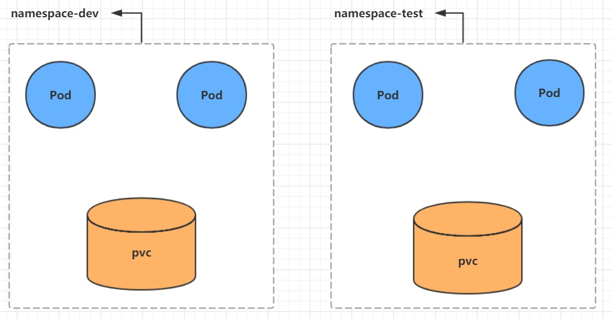

# 第三章 资源管理

本章节主要介绍 yaml 语法和 Kubernetes 的资源管理方式

## 3.1 资源管理介绍

在 kubernetes 中，所有的内容都抽象为资源，用户需要通过操作资源来管理 kubernetes。

> kubernetes 的本质上就是一个集群系统，用户可以在集群中部署各种服务，所谓的部署服务，其实就是在 kubernetes 集群中运行一个个的容器，并将指定的程序跑在容器中。
>
> kunernetes 的最小管理单元就是 pod 而不是容器，所有只能将容器放在 **pod** 中，而 kubernetes 一般也不会直接管理 pod，而是通过 **pod 控制器**来管理 pod 的。
>
> pod 可以提供服务之后，就要考虑如何访问 pod 中服务， kubernetes 提供了 **service** 资源实现这个功能。
>
> 当然，如果 pod 中程序的数据需要持久化，kubernetes 还提供了各种 **存储** 系统


> 学习 kubernetes 的核心，就是学习如何对集群上的 **pod 、pod 控制器、service、存储** 等各种资源进行操作。


## 3.2 YAML 语言介绍

​	YAML 是一个类似 XML、JSON 的标记性语言。它强调以数据为中心，并不是以标识语言为重点。因而 YAML 本身的定义比较简单，号称“一种人性化的数据格式语言”。

YAML 的语法比较简单，主要有下面几个：

* 大小写敏感
* 使用缩进表示层级关系
* 缩进不允许使用 tab，只允许空格
* 缩进的空格数不重要，只要相同层级的元素左对齐即可
* ‘#’ 表示注释

YAML 支持一下几种数据类型：

* 纯量：单个的、不可再分的值
* 对象：键值对的集合，又称为映射（mapping）/ 哈希（hash）/ 字典（dictionary）
* 数组：一组按次序排列的值，又称为序列（sequence）/ 列表（list）

```yaml
# 纯量，就是指的一个简单的值，字符串、布尔值、整数、浮点数、Null、时间、日期
# 1 布尔值
c1: true (或者 True)
# 2 整型
c2: 234
# 3 浮点数
c3: 3.14
# 4 null 类型
c4: ~ # 使用 ～ 表示 null
# 5 日期类型
c5: 2022-07-06 # 日期必须使用 ISO 8601 格式，即 yyyy-MM-dd
# 6 时间类型
c6: 2022-07-06T16:06:06+08:00 # 时间使用 ISO 8601 格式，时间和日期之间使用 T 连接，最后使用 + 代表时区
# 7 字符串类型
c7: haha
c8: line1
	  line2  # 字符串过多的情况可以拆成多行，每一行会被转化成一个空格
```

```yaml
# 对象
# 形式一（推荐）
xiaoming:
  age: 15
  address: guangzhou
# 形式二（了解）
xiaoming: {age: 15,address: guangzhou}
```

```yaml
# 数组
# 形式一（推荐）
address:
  - 天河
  - 黄埔
# 形式二（了解）
address: [天河,黄埔]
```

> 小提示：
>
> 1 书写 yaml 切记 : 后面要加一个空格
>
> 2 如果需要将多段 yaml 配置放在一个文件中，中间要使用 --- 分隔
>
> 3 下面是一个 yaml 转 json 的网站：https://www.json2yaml.com/convert-yaml-to-json


## 3.3 资源管理方式

* 命令式对象管理：直接使用命令去操作 kubernetes 资源

  ```shell
  kubectl run nginx-pod --image=nginx:1.17.1 --port=80
  ```

* 命令式对象配置：通过命令配置和配置文件去操作 kubernetes 资源

  ```
  kubectl create/patch -f nginx-pod.yaml
  ```

* 声明式对象配置：通过 apply 命令和配置文件去操作 kubernetes 资源

  ```
  kubectl apply -f nginx-pod.yaml  // 创建 更新
  ```

|      类型      | 操作对象 | 适用环境 |      优点      |               缺点               |
| :------------: | :------: | :------: | :------------: | :------------------------------: |
| 命令式对象管理 |   对象   |   测试   |      简单      | 只能操作活动对象，无法审计、跟踪 |
| 命令式对象配置 |   文件   |   开发   | 可以审计、跟踪 |  项目大时，配置文件多，操作麻烦  |
| 声明式对象配置 |   目录   |   开发   |  支持目录操作  |        意外情况下难以调试        |

### 3.3.1 命令式对象管理

#### kubectl 命令

 	kubectl 是 Kubernetes 集群的命令行工具，通过它能够对集群本身进行管理，并能够在集群上进行容器化应用的安装部署。kubectl 命令的语法如下：

```md
kubectl [command] [type] [name] [flags]
```

**command**： 指定要对资源执行的操作，例如 create、get、delete

**type**：指定资源类型，比如 deployment、pod、service

**name**：指定资源的名称，名称大小写敏感

**flags**：指定额外的可选参数

```powershell
# 查看所有 pod
kubectl get pod

# 查看某个 pod
kubectl get pod pod_name

# 查看某个 pod,以 yaml 格式展示结果
kubectl get pod pod_name -o yaml
```

#### 资源类型

kubernetes 中所有的内容都抽象为资源，可以通过下面的命令进行查看：

```powershell
kubectl api-resources
```

经常使用的资源有下面这些：

<table>
   <tr>
      <td>资源分类</td>
      <td>资源名称</td>
      <td>缩写</td>
      <td>资源作用</td>
   </tr>
   <tr>
      <td rowspan="2">集群级别资源</td>
      <td>nodes</td>
      <td>no</td>
      <td>集群组成部分</td>
   </tr>
   <tr>
      <td>namespaces</td>
      <td>ns</td>
      <td>隔离 pod</td>
   </tr>
   <tr>
      <td>pod 资源</td>
      <td>pods</td>
      <td>po</td>
      <td>装载容器</td>
   </tr>
   <tr>
      <td rowspan="8">pod 资源控制器</td>
      <td>replicationcontrollers</td>
      <td>rc</td>
      <td>控制 pod 资源</td>
   </tr>
   <tr>
      <td>replicasets</td>
      <td>rs</td>
      <td>控制 pod 资源</td>
   </tr>
   <tr>
      <td>deployments</td>
      <td>deploy</td>
      <td>控制 pod 资源</td>
   </tr>
   <tr>
      <td>daemonsets</td>
      <td>ds</td>
      <td>控制 pod 资源</td>
   </tr>
   <tr>
      <td>jobs</td>
      <td></td>
      <td>控制 pod 资源</td>
   </tr>
   <tr>
      <td>cronjobs</td>
      <td>cj</td>
      <td>控制 pod 资源</td>
   </tr>
   <tr>
      <td>horizontalpodautoscalers</td>
      <td>hpa</td>
      <td>控制 pod 资源</td>
   </tr>
   <tr>
      <td>statefulsets</td>
      <td>sts</td>
      <td>控制 pod 资源</td>
   </tr>
   <tr>
      <td rowspan="2">服务发现资源</td>
      <td>services</td>
      <td>svc</td>
      <td>统一 pod 对外接口</td>
   </tr>
   <tr>
      <td>ingress</td>
      <td>ing</td>
      <td>统一 pod 对外接口</td>
   </tr>
   <tr>
      <td rowspan="3">存储资源</td>
      <td>volumeattachments</td>
      <td></td>
      <td>存储</td>
   </tr>
   <tr>
      <td>persistentvolumes</td>
      <td>pv</td>
      <td>存储</td>
   </tr>
   <tr>
      <td>persistentvolumeclaims</td>
      <td>pvc</td>
      <td>存储</td>
   </tr>
   <tr>
      <td rowspan="2">配置资源</td>
      <td>configmaps</td>
      <td>cm</td>
      <td>配置</td>
   </tr>
   <tr>
      <td>secrets</td>
      <td></td>
      <td>配置</td>
   </tr>
</table>

#### 操作

Kubernetes 允许对资源进行多种操作，可以通过 --help 查看详细的操作命令

```powershell
kubectl --help
```

经常使用的操作有下面这些：

<table>
   <tr>
      <td>命令分类</td>
      <td>命令</td>
      <td>翻译</td>
      <td>命令作用</td>
   </tr>
   <tr>
      <td rowspan="6">基本命令</td>
      <td>create</td>
      <td>创建</td>
      <td>创建一个资源</td>
   </tr>
   <tr>
      <td>edit</td>
      <td>编辑</td>
      <td>编辑一个资源</td>
   </tr>
   <tr>
      <td>get</td>
      <td>获取</td>
      <td>获取一个资源</td>
   </tr>
   <tr>
      <td>patch</td>
      <td>更新</td>
      <td>更新一个资源</td>
   </tr>
   <tr>
      <td>delete</td>
      <td>删除</td>
      <td>删除一个资源</td>
   </tr>
   <tr>
      <td>explain</td>
      <td>解释</td>
      <td>解释资源文档</td>
   </tr>
  <tr>
      <td rowspan="10">运行与调试</td>
      <td>run</td>
      <td>运行</td>
      <td>在集群中运行一个指定的镜像</td>
   </tr>
   <tr>
      <td>expose</td>
      <td>暴露</td>
      <td>暴露资源为 service</td>
   </tr>
   <tr>
      <td>describe</td>
      <td>描述</td>
      <td>显示资源内部信息</td>
   </tr>
   <tr>
      <td>logs</td>
      <td>日志</td>
      <td>输出容器在 pod 中的日志</td>
   </tr>
   <tr>
      <td>attach</td>
      <td>缠绕</td>
      <td>进去运行中的容器</td>
   </tr>
   <tr>
      <td>exec</td>
      <td>执行</td>
      <td>执行容器中的一个命令</td>
   </tr>
   <tr>
      <td>cp</td>
      <td>复制</td>
      <td>在 pod 内外复制文件</td>
   </tr>
   <tr>
      <td>rollout</td>
      <td>首次展示</td>
      <td>管理资源的发布</td>
   </tr>
   <tr>
      <td>scale</td>
      <td>规模</td>
      <td>扩（缩）容 pod 的数量</td>
   </tr>
   <tr>
      <td>autoscale</td>
      <td>自动调整</td>
      <td>自动调整 pod 的数量</td>
   </tr>
  <tr>
      <td rowspan="2">高级命令</td>
      <td>apply</td>
      <td>rc</td>
      <td>通过文件对资源进行配置</td>
   </tr>
   <tr>
      <td>label</td>
      <td>标签</td>
      <td>更新资源上的标签</td>
   </tr>
   <tr>
      <td rowspan="2">其他命令</td>
      <td>cluster-info</td>
      <td>集群信息</td>
      <td>显示集群信息</td>
   </tr>
   <tr>
      <td>version</td>
      <td>版本</td>
      <td>显示当前server和 client 的版本</td>
   </tr>
</table>


### 3.3.2 命令式对象配置

命令式对象配置就是使用命令配合配置文件一起来操作 kubernetes 资源

1）创建一个 nginxpod.yaml ，内容如下：

```yaml
apiVersion: v1
kind: Namespace
metadata:
  name: dev
  
---

apiVersion: v1
kind: Pod
metadata:
  name: nginxpod
  namespace: dev
spec:
  containers:
  - name: nginx-containers
    image: nginx:1.17.1
```

2）执行 create 命令，创建资源：

```powershell
kubectl create -f nginxpod.yaml
```

3）执行 get 命令，查看资源：

```
kubectl get -f nginxpod.yaml
```

4）执行 delete 命令，删除资源：

```
kubectl delete -f nginxpod.yaml
```

```md
总结：
		命令式对象配置的方式操作，可以简单的认为： 命令 + yaml 配置文件
```


### 3.3.3 声明式对象配置

声明式对象配置跟命令式对象配置很相似，但是它只有一个命令 apply。

```powershell
# 首次执行一次， 创建了资源
kubectl apply -f nginxpod.yaml

# 再次执行 说资源没动过
namespace/dev unchanged
pod/nginxpod unchanged
```

```
总结：
		声明式对象配置就是使用 apply 描述一个资源最终的状态（ yaml 中定义状态）
		使用 apply 操作资源：
				如果资源不存在，就创建，相当于 kubectl create
				如果资源已存在，就更新，相当于 kubectl pathch
```

> 扩展： kubectl 可以在 node 节点上运行吗？
>
> kubectl 的运行需要配置，它的配置文件在 $HOME/.kube，如果想要在节点 node 运行此命令，需要将 master 的 .kube 文件复制到 node 节点上

```
scp -r HOME/.kube node1:HOME/
```

> 使用推荐：三种方式应该怎么用？

创建/更新资源   使用声明式对象配置 kubectl apply -f yaml

删除资源  使用命令式对象配置  kubectl delete -f yaml

查询资源 使用命令式对象管理 kubectl get/describe  name


# 第四章 实战入门

 ## 4.1 Namespace

​	Namespace 是 kubernetes 系统中的一种非常重要的资源，它的主要作用是用来实现**多套环境的资源隔离**或者**多租户的资源隔离**

​	默认情况下，kubernetes 集群中的所有的 pod 都是可以相互访问的。但是在实际中，可能不想让两个 pod 之间进行互相的访问，那此时就可以将两个 pod 划分到不同的 namespace 下。kubernetes 通过将集群内部的资源分配到不同的 namespace 中，可以形成逻辑上的“组”，以方便不同的组的资源进行隔离使用和管理。

​	可以通过 kubernetes 的授权机制，将不同的 kubernetes 交给不同租户进行管理，这样就实现了多租户的资源隔离。此时还能结合 kubernetes 的资源配额机制，限定不同租户能占用的资源，例如 cpu 使用量、内存使用量等等，来实现租户可用资源的管理。



Kubernetes 在集群启动之后，会默认创建几个 namespace

 ```powershell
 # kubectl get ns
 NAME                   STATUS   AGE
 default                Active   60d   # 所有未指定 namespace 的对象都会被分配在 default 命名空间
 kube-node-lease        Active   60d   # 集群节点之间的心跳维护， v1.13 开始引入
 kube-public            Active   60d   # 此命名空间下的资源可以被所有人访问（包括未认证用户）
 kube-system            Active   60d   # 所有由 kubernetes 系统创建的资源都处于这个命名空间
 ```

下面来看 namespace 资源的具体操作

**查看**

```powershell
# 1 查看所有 ns 
kubectl get ns
# 2 查看指定的 ns
kubectl get ns name
# 3 指定输出格式  kubetctl get ns ns名称 -o 格式参数
# kubenetes 支持的格式有很多，比如 wide、json、yaml
kubectl get ns name -o yaml  

# 4 查看 ns 详情 kubectl describe ns ns名称
kubectl describe ns default
Name:         default
Labels:       kubernetes.io/metadata.name=default
Annotations:  <none>
Status:       Active   ## Active 命名空间正在使用。Terminating 正在删除命名空间
```

**创建**

```powershell
# 创建 namespace
kubectl create ns dev
```

**删除**

```powershell
# 删除 namespace
kubectl delete ns dev
```

**配置方式**

首先准备一个 yaml 文件： ns-dev.yaml

```yaml
apiVersion: v1
kind: Namespace
metadata:
  name: dev
```

然后就可以执行对应的创建和删除命令了：

​	创建：kubectl create -f ns-dev.yaml

​	删除：kubectl delete -f ns-dev.yaml


## 4.2 Pod

Pod 是 kuberbetes 集群进行管理的最小单元，程序要运行必须部署在容器中，而容器必须存在于 pod 中，pod 可以认为是容器的封装，一个 Pod 可以存在一个或者多个容器。

// image

Kubernetes 在集群启动之后，集群中的各个组件也都是以 pod 方式运行。可通过下面命令查看：

```powershell
kubectl get pod -n kube-system
```

**创建并运行**

Kubenetes 没有提供单独运行 pod 的命令，都是通过 pod 控制器来实现的

```powershell
# 命令格式：kubectl run (pod 控制器名称) 【参数】
# --image 指定 pod 的镜像
# --port 指定端口
# --namespace 指定namespace
kubectl run nginx --image=nginx:1.17.1 --port=80 --namespace=dev
```

**查看 pod 信息**

```powershell
# 查看 pod 基本信息
kubectl get pod -n dev
# 查看 pod 的详细信息
kubectl describe pod pod-name -n dev
```

**访问 pod**

```powershell
# 获取 pod IP
kubectl get pod -n dev -o wide
# 访问 pod
curl IP:port
```

**删除指定 pod**

```powershell
# 删除指定 pod
kubectl delete pod pod-name -n dev

# 此时，显示删除 pod 成功，但是再查询，发现又新产生一个

# 这是因为当前 pod 由 pod 控制器创建的，控制器会监控 pod 状况，一旦发现 pod 死亡，会立即重建
# 此时要想删除 pod，必须删除 pod 控制器

# 查看当前 namespace 下的 pod 控制器
kubectl get deploy -n dev

# 删除 pod 控制器
kubectl delete deploy nginx -n dev

# 查询 pod，发现 pod 被删除了
```

**配置操作**

创建一个 pod-nginx.yaml，内容如下：

```yaml
apiVersion: v1
kind: Pod
metadata:
	name: nginx
	namespace: dev
spec:
	containers:
	-	image: nginx:1.17.1
		imagePullPolicy: IfNotPresent
		name: pod
		ports:
		-	name: nginx-port
			containerPort: 80
			protocol: TCP
```

然后就可以执行对应的创建和删除命令了：

​	创建：kubectl create -f pod-nginx.yaml

​	删除：kubectl delete -f pod-nginxyaml


## 4.3 Label

Label 是 kubernetes 系统中的一个重要概念。它的作用就是在资源上添加标识，用来对他们进行区分和选择。

Label 的特点：

* 一个 Label 会以 key/value 键值对的形式附加到各种对象上，如 Node、Pod、Service 等等
* 一个资源对象可以定义任意数量的 label ，同一个 Label 也可以被添加到任意数量的资源对象上去
* Label 通常在资源对象定义时确定，当然也可以在对象创建后动态添加或删除

可以通过 Label 实现资源的多维度分组，以便灵活、方便地进行资源分配、调度、配置、部署等管理工作。

> 一些常用的 Label 示例如下：
>
> * 版本标签："version":"release", "version":"stable"...
> * 环境标签："environment":"dev", "environment":"test"
> * 架构标签："tier":"frontend", "tier":"backend"

标签定义完毕之后，还要考虑到标签的选择，这就要使用到 Label Selector，即：

​	Label 用于给某个资源对象定义标识

​	Label Selector 用于查询和筛选拥有某些标签的资源对象

当前有两种 Label Selector：

* 基于等式的 Label Selector

  name=salve:选择所有包含 Label 中 key="name" 且 value="salve" 的对象

  Env !=production:选择所有包括 Label 中 key="name" 且 value 不等于 "production" 的对象

* 基于集合的 Label Selector

  name in (master, salve):选择所有包含 Label 中 key="name" 且 value="salve" 或 “master” 的对象

  Name not in (frontend):  选择所有包含 Label 中的 key="name" 且 value 不等于 "frontend" 的对象

标签的选择可以使用多个，此时将多个 Label Selector 进行组合，使用逗号 "," 进行分隔即可。例如：

​	   name=salve, env != production

​		name not in (frontend), env != production


**命令方式**

```powershell
# 为 pod 资源打标签
kubectl label pod pod-name version=1.0 -n dev
# 为 pod 资源更新标签
kubectl label pod pod-name version=2.0 -n dev --overwrite
# 查看标签
kubectl get pod pod-name -n dev --show-labels
# 筛选标签
kubectl get pod pod-name -n dev -l version=2.0 --show-labels
#删除标签
kubectl label  pod pod-name -n dev tire-  // 标签 -
```

**配置方式**

```yaml
apiVersion: v1
kind: Pod
metadata:
  name: nginx
  namespace: dev
  labels:
    version: "3.0"
    env: "test"
spec:
  containers:
  - image: nginx:1.17.1
    imagePullPolicy: IfNotPresent
    name: pod
    ports:
    - name: nginx-port
      containerPort: 80
      protocol: TCP
```


## 4.4 Deployment

​	在 kubernetes 中，Pod 是最小的控制单元，但是 kubernetes 很少直接控制 pod ，一般都是通过 pod 控制器来完成的。Pod 控制器用于 Pod 的管理，确保 pod 资源符合预期的状态，当 pod 的资源出现故障时，会尝试进行重启或重建 pod 。

​	在 kubernetes 控制器的种类很多，这里介绍： deployment。

// todo  image

**命令操作**

```powershell
# 命令格式： kubectl run deployment名称 [参数]
# --image 指定 pod 的镜像
# --port 指定端口
# --replicas 指定创建 pod 数量
# --namespace 指定 namespace

kubectl run nginx --image=nginx:1.17.1 --port=80 --replicas=3 -n dev

# 查看创建的 pod 
kubectl get pod -n dev
# 查看deployment 的信息
kubectl get deploy deploy-name -n dev

# UP-TO-DATE：成功升级的副本数量
# AVAILABLE: 可用副本的数量
kubectl get deploy -n dev -o wide

# 查看 deployment 详细信息
kubectl describe deploy deploy-name -n dev
# 删除 deployment
kubectl delete deploy name -n dev
```

 **配置操作**

创建 deploy-nginx.yaml，内容如下：

```yaml
apiVersion: apps/v1
kind: Deployment
metadata:
  name: nginx
  namespace: dev
spec:
  replicas: 3
  selector:
    matchLabels:
      run: nginx
  template:
    metadata:
      labels:
        run: nginx
    spec:
      containers:
      - image: nginx:1.17.1
        imagePullPolicy: IfNotPresent
        name: pod
        ports:
        - name: nginx-port
          containerPort: 80
          protocol: TCP
```

然后就可以执行对应的创建和删除命令了：

​	创建：kubectl create -f deploy-nginx.yaml

​	删除：kubectl delete -f deploy-nginx.yaml


## 4.5 Service

能利用 Deployment 来创建一组 pod 来提供具有高可用性的服务。虽然每个 pod 都会分配一个单独的 pod IP，然而却存在如下两问题：

* Pod IP 都随着 pod 的重建产生变化
* Pod IP 仅仅是集群内可见的虚拟 IP，外部无法访问

这样对于访问这个服务带来了难度。因此， kubernetes 设计了 Serveice 来解决这个问题。

Service 可以看作是一组同类 Pod **对外的访问接口**。借助 Service 应用可方便地实现服务发现和负载均衡。

//todo  image

**操作一：创建集群内部可访问的 service**

```powershell
# 暴露 Service
kubectl expose deploy nginx --name=svc-nginx1 --type=ClusterIP --port=80 --target-port=80 -n dev

# 查看 Service
kubectl get svc svc-nginx -n dev -o wide

# 这里产生了一个 ClusterIP ，这就是 Service 的 IP，在 Service 的生命周期中，这个地址是不会变动的
# 可以通过这个 IP 访问当前 service 对应的 Pod
```


**操作二：创建集群外部也可访问的 Service**

```powershell
# 上面创建的 Service 的 type 类型为 ClusterIP，这个 IP 地址只能集群内部访问
# 如果需要创建外部也可以访问的 Service ，需要修改 type 为 NodePort
kubectl expose deploy nginx --name=svc-nginx2 --type=NodePort --port=80 --target-port=80 -n dev

# 此时查看，会发现出现了 NodePort 类型的 Service，而且有一对 Port 
kubectl get svc -n dev -o wide

# 就可以通过集群外的主机访问节点 IP:port 
```


**删除 Service**

```
kubectl delete svc svc-name -n dev
```


**配置方式**

创建一个 svc-nginx.yaml，内容如下：

```yaml
apiVersion: v1
kind: Service
metadata:
  name: svc-nginx
  namespace: dev
spec:
  ClusterIP: 172.0.2.12
  ports:
  - port: 80
    protocol: TCP
    targetPort: 80
  selector:
    run: nginx
  type: ClusterIP
```

然后就可以执行对应的创建和删除命令了：

​	创建：kubectl create -f svc-nginx.yaml

​	删除：kubectl delete -f svc-nginx.yaml


# 第五章 Pod 详解

## 5.1 Pod 介绍

### 5.1.1 Pod 结构

// todo image

每个 Pod 中都可以包含一个或者多个容器，这些容器可以分为两类：

* 用户程序所在的容器，数量可多可少

* Pause 容器，这是每个 Pod 都会有的一个**根容器**，它的作用有两个：

  * 可以以它为依据，平贵整个 Pod 的 健康状态

  * 可以在根容器上设置 IP 地址，其他容器都是此 IP，以实现 Pod 内部的网路通信

    ```
    这里是 Pod 内部通讯，Pod 的之间通讯采用虚拟二层网络技术实现
    ```

### 5.1.2 Pod 定义

下面是 Pod 的资源清单

```yaml
apiVerson: v1    #必选，版本号，例如 v1
kind: Pod  #必选，资源类型，例如 Pod
metadate:  # 必选，元数据
  name: string # 必选，Pod 名称
  namespace: # Pod 所属的命名空间，默认为 "default"
  labels:   # 自定义标签
    - name: string
spec:  # 必选，Pod 中容器的详细定义
  containers: # 必选， Pod 容器列表
  - name: # 必选，容器名称
    image: # 必选，容器的镜像名称
    imagePullPolicy: [ Always|Never|IfNotPresent ] # 获取镜像的策略
    command: [string] # 容器的启动命令列表，如不指定，使用打包时使用的启动命令
    args: [string] # 容器的启动命令参数列表
    workingDir: string # 容器的工作目录
    volumeMounts: # 挂载到容器内部的存储卷位置
    - name: string # 引用 Pod 定义的共享存储卷的名称，需要 volume[] 部分定义的卷名
      mountPath: string # 存储卷在容器内 mount 的绝对路径，应少于 512  字符
      readOnly: boolean # 是否为只读模式
    port: # 需要暴露的端口库号列表
    - name: string # 端口的名称
      containerPort: int # 容器需要监听的端口号
      hostPort: int # 容器所在主机需要监听的端口号，默认与 Container 相同
      protocol: string # 端口协议，支持 TCP 和 UDP，默认 TCP
    env:  # 容器运行前需设置的环境变量列表
    - name: string # 环境变量名称
      value: string # 环境变量的值
    resources: # 资源限制和请求的设置
      limits: # 资源限制的值
  
```

```powershell
# 小提示：
# 可以通过一个命令来查看每种资源的可配置项
# kubectl explain 资源类型
# kubectl explain 资源类型.属性
kubectl explain pod
kubectl explain pod.metadata
```

在 kubernetes 中所有资源的一级属性都是一样的，主要包含 5 部分：

* apiVersion <string>  版本，由 kubenetes 内部定义，版本号必须可以用 kubetctl api-versions 查询到
* kind  <string>            类型，由 kubenetes 内部定义，版本号必须可以用 kubetctl api-resources 查询到
* metadata <Object>   元数据，主要是资源标识和说明，常用的有 name、namespace、labels 等
* spec <Object>            描述，这里配置中最重要的一部分，里面是对各种资源配置的详细描述
* status <Object>         状态信息，里面的内容不需要定义，由 kubernetes 自动生成

在上面的属性中，spec 是接下来研究的重点，看常见的子属性：

* containers <[]Object>  容器列表，用于定义容器的详细信息
* nodeName <string> 根据 nodeName 的值将 pod 调度到指定的 Node 节点上
* nodeSelector <map[]> 根据 nodeSelector 中定义的信息选择将该 pod 调度到这些 label 的 Node 上
* hostNetwork  <boolean> 是否使用主机网络模式，默认为 false，如果设置为 true，表示使用宿主机网络
* volumes <[]object> 存储卷，用于定义 pod 上面挂在的存储信息
* restartPolicy <string> 重启策略，表示 pod 在遇到故障的时候的处理策略

## 5.2 Pod 配置

本小节主要来研究 pod.spec.containers 属性，这也是 pod 配置中最为关键的一项配置。

```powershell
kubectl explain pod.spec.containers

FIELDS:
	name <string> # 容器名称
	image <string> # 容器需要的镜像地址
	imagePullPolicy <string> # 镜像拉取策略
	command <[]string> # 容器的启动命令列表，如不指定，使用打包时使用的命令
	args <[]string> # 容器的启动命令需要的参数列表
	env <[]Object> # 容器环境变量的配置
	ports  # 容器需要暴露的端口
	resources <Object> # 资源限制和资源请求的设置
```

### 5.2.1 基本配置

创建的 pod-base.yaml 文件，内容如下：

```yaml
apiVersion: v1
kind: Pod
metadata:
  name: pod-base
  namespace: dev
  labels:
    user: heima
spec:
  containers:
  - name: nginx
    image: nginx:1.17.1
  - name: busybox
    image: busybox:1.30
```

上面定义一个比较简单的 Pod 的配置，里面有两个容器：

* Nginx：用 1.17.1 版本的 nginx 镜像创建
* Busy box：用 1.30 版本的 busy box 镜像创建

```powershell
# 创建 pod 
kubectl apply -f pod-base.yaml

# 查看 pod 状况
# READY 1/2 ：表示当前 Pod 有两个容器，其中一个准备就绪，一个未就绪
# RESTARTS ：重启次数，因为有 1 个容器故障，Pod 一直在重启恢复它
kubectl get pod -n dev

# 可以通过 describe 查看内部情况
# 此时已经运行起来一个基本的 Pod，虽然暂时有问题
kubectl describe pod pod-name -n dev
```

### 5.2.2 镜像拉取

创建 pod-imagepullpolicy.yaml 文件，内容如下：

```yaml
apiVersion: v1
kind: Pod
metadata:
  name: pod-imagepullpolicy
  namespace: dev
spec:
  containers:
  - name: nginx
    image: nginx:1.17.1
    imagePullPolicy: Always  # 用于设置镜像拉取策略
  - name: busybox
    image: busybox:1.30
```

imagePullPolicy，用于设置镜像拉取策略，kubernetes 支持配置三种拉取策略：

* Always： 总是从远程仓库拉去镜像（一直用远程的）
* IfNotPresent：本地有则使用本地镜像，本地没有则从远程仓库拉去镜像（本地有就本地，本地没有就远程）
* Never：只使用本地镜像，从不去远程仓库拉取，本地没有就报错（一直使用本地）

> 默认值说明：
>
> ​	如果镜像 tag 为具体版本号，默认策略是：IfNotPresent
>
> ​	如果镜像 tag 为 latest （最终版本），默认策略是 always

```powershell
# 创建 pod 
kubectl apply -f pod-imagepullpolicy.yaml
```

### 5.2.3 启动命令

​	在前面的案例中，一直有一个问题没有解决，就是 busybox 容器一直没有运行成功，那么到底是什么原因导致这个容器的故障呢？

​	原来 busy box 并不是程序，而是类似一个工具类的集合， kubenetes 集群启动管理后，它会自动关闭，解决方法就是让其一直运行，就用到了 command 配置。

创建 pod-command.yaml 文件，内容如下：

```yaml
apiVersion: v1
kind: Pod
metadata:
  name: pod-command
  namespace: dev
spec:
  containers:
  - name: nginx
    image: nginx:1.17.1
  - name: busybox
    image: busybox:1.30
    command: ["/bin/sh","-c","touch /tmp/hello.txt;while true; do /bin/echo $(date +%T) >> /tmp/hello.txt; sleep 3; done;"]
```

Command，用于在 pod 中的容器初始化完毕之后运行一个命令。

```powershell
# 创建 pod 
kubectl create -f pod-command.yaml

# 查看状态
kubectl get pod pod-command -n dev

# 进入容器中的 busybox 查看文件内容
# 补充一个命令：kubectl exec pod名称 -n 命名空间 -it -c 容器名称 /bin/sh 在容器内部执行命令
kubectl exec pod-command -n dev -it -c busybox /bin/sh

tail -f /tmp/hello.txt
```

> 特别说明：
>
> ​	通过上面发现 command 已经可以完成启动命令和传递参数的功能，为什么这里还要提供一个 args 选项，用于传递参数呢？这其实跟 docker 有关系的，kubernetes 中的 command、args 两项其实是实现覆盖 dockerfile 的 ENYTRYPOINT 的功能。
>
> 1. 如果 command 和 args 都没有写，那么用 dockerfile p配置
> 2. 如果 command 写，args 没有写，那么 dockerfile 默认的配置会被忽略，执行输入的 command
> 3. 如果 command 没写，args 写了，那么 dockerfile 中配置的 EXTRYPOINT 的命令会被执行，使用当前 args 的参数
> 4. 如果 command 和 args 都写了，那么 dockerfile 的配置会被忽略，执行 command 并加上 args 参数。	


### 5.2.4 环境变量

创建 pod-env.yaml 文件，内容如下：

```yaml
apiVersion: v1
kind: Pod
metadata:
  name: pod-env
  namespace: dev
spec:
  containers:
  - name: busybox
    image: busybox:1.30
    command: ["/bin/sh","-c","touch /tmp/hello.txt;while true; do /bin/echo $(date +%T) >> /tmp/hello.txt; sleep 3; done;"]
    env:
    - name: "username"
      value: "admin"
    - name: "passwd"
      value: "12345"
```

 Env 环境变量，用于在 pod 中容器设置环境变量

```powershell
# 创建 pod 
kubectl create -f pod-env.yaml

# 进入容器中的 busybox 
kubectl exec pod-env -n dev -it -c busybox /bin/sh
```


### 5.2.5 端口设置

介绍容器的端口暴露，也就是 containers 的 ports 选项

Ports 支持的子选项：

```powershell
kubectl explain pod.spec.containers.ports
FIELDS:
  name  				<string> 	# 端口名称，如果指定，必须保证 name 在 pod 中是唯一的
  containerPort <integer> # 容器要监听的端口( 0 < x < 65536)
  hostPort 			<integer> # 容器要在主机上公开的端口，如果设置，主机上只能运行容器的一个副本
  hostIP 				<string> 	#	要将外部端口绑定到的主机IP
  protocol 			<string> 	# 端口协议。必须是 UDP、TCP 或 SCTP。默认为 "TCP"
```

创建 pod-ports.yaml

```yaml
apiVersion: v1
kind: Pod
metadata:
  name: pod-ports
  namespace: dev
spec:
  containers:
  - name: nginx
    image: nginx:1.17.1
    ports:
    - name: nginx-port
      containerPort: 80
      protocol: TCP
```

```powershell
# 创建 pod 
kubectl create -f pod-ports.yaml

# 查看 pod
kubectl get pod pod-ports -n dev -o yaml

```

访问容器中的程序需要使用的是  podIP:containerPort


### 5.2.6 资源配额

​	容器中的程序要运行，肯定是要占用一定资源的，比如 CPU 和内存等，如果不对某个容器的资源做限制，那么它就可能吃掉大量资源，导致其他容器无法运行。针对这种情况，kubernetes 提供了对内存和 CPU 的资源进行配额的机制，这种机制主要通过 resources 选项实现。它有两个子选项：

* Limits: 用于限制运行时容器的最大占用资源，当容器占用资源超过 limits 时会被终止，并进行重启
* Requests: 用于设置容器需要的最小资源，如果环境资源不够，容器将无法启动。

可以通过上面两个选项设置资源的上下限：

创建 pod-resources.yaml

```yaml
apiVersion: v1
kind: Pod
metadata:
  name: pod-resources
  namespace: dev
spec:
  containers:
  - name: nginx
    image: nginx:1.17.1
    resources: # 资源配额
      limits: # 资源限制（上限）
        cpu: "2" # CPU 限制，单位是 core 数
        memory: "10Gi" # 内存限制
      requests: # 请求资源（下限）
        cpu: "1"
        memory: "10Mi"
```

在这对 cpu 和 memory 的单位做一个说明：

* Cpu: core 数，可以为整数或小数
* Memory：内存大小，可以使用 Gi 、Mi、G、M 等形式

```yaml
# 运行 pod
kubectl create -f pod-resources.yaml

```


## 5.3 Pod 生命周期

​	我们一般将 pod 对象从创建至终的这段时间范围称为 pod 的生命周期，它主要包括下面的过程：

* pod 创建过程
* 运行初始化容器（init container ）过程
* 运行主容器（ main container ）过程
  * 容器启动后钩子（post start）、容器终止前钩子（pre stop）
  * 容器的存活性探测（liveness probe）、就绪性探测 （readiness probe）
* pod 终止过程


在整个生命周期中，Pod 会出现 5 种状态，分别如下：

* 挂起（pending）：apiserver 已经创建了 pod 资源对象，但它尚未被调度完成或者仍处于下载镜像的过程中
* 运行中（running）：pod 已经被调度至某节点，并且所有容器都已经被 kubelet 创建完成
* 成功（succeeded）：pod 中的所有容器都已经成功终止并且不会被重启
* 失败（failed）：所有容器都已经终止，但至少有一个容器终止失败，即容器返回了非 0 值的退出状态
* 未知（unknown）：apiserver 无法正常获取到 pod 对象的状态信息，通常由网络通信失败所导致

### 5.3.1 创建和终止

**Pod 的创建过程**

1. 用户通过 kubectl 和其他 api 客户端提交需要创建的 pod 信息给 apiServer
2. apiServer 开始生成 pod 对象的信息，并将信息存入 etcd，然后返回确认信息至客户端
3. apiServer 开始反映 etcd 中的 pod 对象的变化，其他组件使用 watch 机制来跟踪检查 apiServer 上的变动
4. Scheduler 发现由新的 pod 对象要创建，开始为 pod 分配主机并将结果信息更新至 apiServer
5. Node 节点上的 kubelet 发现有 pod 调度过来，尝试调用 docker 启动容器，并将结果回送至 apiServer
6. apiServer 将接收到的 pod 状态信息存入 etcd 中


 **Pod 的终止过程**

1. 用户向 apiServer 发送删除 pod 对象的命令
2. apiServer 中的 pod 对象信息会随着时间的推移而更新，在宽限期内（默认 30s ），pod 被视为为 dead
3. 将 pod 标记为 terminating 状态
4. Kubelet 在监控到 pod 对象转为 terminating 状态的同时启动 pod 关闭过程
5. 端点控制器监控到 pod 对象的关闭行为时将其从所有匹配到此端点的 service 资源的端点列表中移除
6. 如果当前 pod 对象定义了 preStop 钩子处理器，则在其标记为 terminating 后即会以同步的方式启动执行
7. Pod 对象中的容器进程接收到停止信号
8. 宽限期结束后，若 pod 中还存在仍在运行的进行，那么 pod 对象会收到立即终止的信号
9. Kubelet 请求 apiServer 将此 pod 资源的宽限期设置为 0 从而完成删除操作，此时 pod 对于用户不可见


### 5.3.2

初始化容器是在 pod 的主容器启动之前要运行的容器，主要是做一些主容器的前置工作，它具有两大特征：

1. 初始化容器必须运行完成直至结束，若某初始化容器运行失败，那么 kubernetes 需要重启它直到成功完成
2. 初始化容器必须按照定义的顺序执行，当且仅当一个成功之后，后面的一个才能运行

初始化容器有很多的应用场景，下面列出的是最常见的几个：

* 提供主容器镜像中不具备的工具程序或自定义代码
* 初始化容器要先于应用容器串行启动并运行完成，因此可用于延后应用容器的启动直至其依赖的条件得到满足

下面是一个案例，模拟下面这个需求：

​	假设要以主容器运行 nginx，但是要求在运行 nginx 之前先要能够连上 mysql 和 redis 所在的服务器

​	为了简化测试，实现规定好 mysql 和 redis 服务器地址

创建 pod-initcontainer.yaml，内容如下：

```yaml
apiVersion: v1
kind: Pod
metadata:
  name: pod-initcontainer
  namespace: dev
spec:
  containers:
  - name: main-container
    iamge: nginx:1.17.1
    ports:
  initContainers:
  - name: test-mysql
    image: busybox:1.30
    command: ['sh', '-c', 'until ping 192.182.1.3 -c 1; do echo waiting for mysql...; sleep 2;done;']
  - name: test-redis
    image: busybox:1.30
    command: ['sh', '-c', 'until ping 192.182.1.4 -c 1; do echo waiting for redis...; sleep 2;done;']
```

